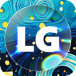
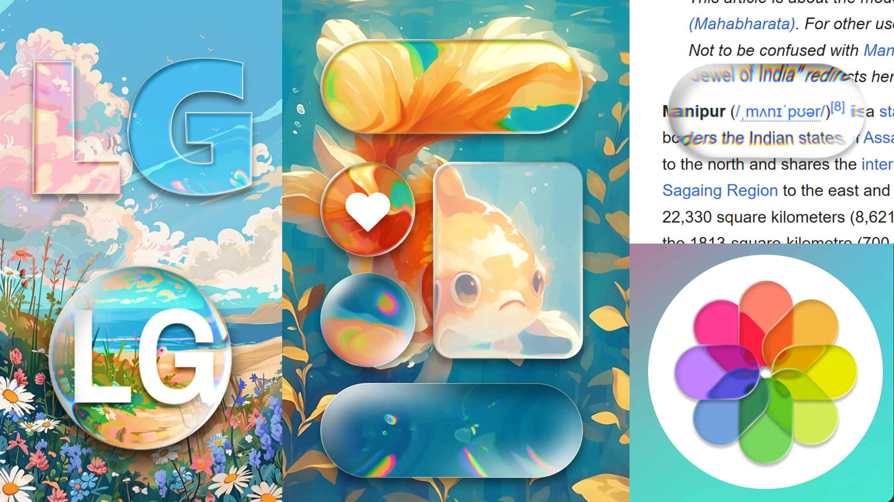
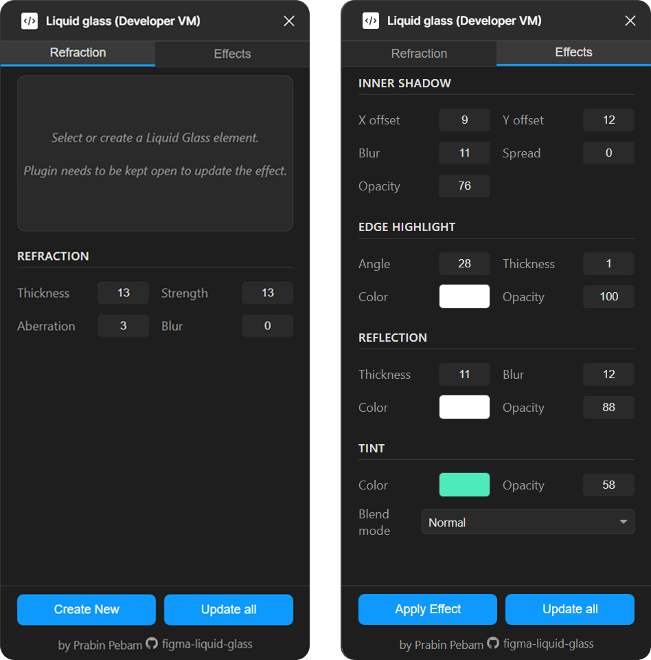

#  Liquid Glass Figma Plugin



## Overview
"Liquid Glass" is a Figma plugin that creates and manages realistic liquid glass components using WebGL shaders. The plugin generates a pre-structured, multi-layer frame that captures the background beneath it and applies advanced visual effects like refraction, chromatic aberration, blur, inner shadows, edge highlights, reflections, and tints to simulate a liquid glass appearance.

## UI


## Features

### Dual-Tab Interface
The plugin features a clean, compact dual-tab interface:

#### **Refraction Tab**
- **Real-time background capture** with WebGL preview
- **Edge thickness** control (1-50px) - Controls the distortion area
- **Refraction strength** (1-100) - Intensity of the distortion effect
- **Chromatic aberration** (0-30) - Color separation at edges
- **Background blur** (0-20) - Frosting effect intensity

#### **Effects Tab**
Complete control over visual styling:

**Inner Shadow**
- X/Y offset, blur, spread, and opacity controls
- Creates depth and definition within the glass

**Edge Highlight**
- Angle-adjustable gradient stroke
- Customizable color, thickness, and opacity
- Simulates light reflection on glass edges

**Reflection**
- Thickness and blur controls for highlight effects
- Color and opacity customization
- Creates realistic light reflections

**Tint**
- Color picker with opacity control
- 20+ blend modes including Normal, Multiply, Screen, Overlay, and advanced modes
- Adds subtle color tinting to the glass effect

### Smart Selection Handling
The plugin intelligently handles different selection scenarios:

- **Single LG Element**: Real-time parameter updates with live preview
- **Single Non-LG Element**: Shows "Apply Effect" button to convert existing shapes
- **Multiple Selection**: Batch parameter updates with "Update selection" button
- **No Selection**: Default creation mode with "Create New" button

### Advanced Shape Support
- **Simple shapes**: Rectangles and ellipses with full parameter control
- **Complex shapes**: Automatic vectorization and custom mask generation
- **Nested elements**: Recursive discovery of LG elements within groups and frames

## Getting Started

### Prerequisites
- Node.js (version 18 or later)
- npm (Node package manager)
- Figma (desktop or web version)

### Installation
1. Clone the repository:
   ```bash
   git clone https://github.com/prabinpebam/figma-liquid-glass.git
   cd liquid-glass
   ```

2. Install the dependencies:
   ```bash
   npm install
   ```

### Development
1. Build the plugin for development:
   ```bash
   npm run build
   ```

2. Start watch mode for live development:
   ```bash
   npm run dev
   ```

3. Import the plugin in Figma:
   - Open Figma and navigate to Plugins → Development → Import plugin from manifest
   - Select the `manifest.json` file from the project root
   - Run the plugin from Plugins → Development → Liquid Glass

## Usage Workflows

### Creating New Elements
1. **Open the Liquid Glass plugin**
2. **Configure parameters** in both Refraction and Effects tabs
3. **Click "Create New"** - A new element appears at the viewport center
4. The element automatically switches to live edit mode

### Applying to Existing Shapes
1. **Select any shape** (rectangle, ellipse, or complex vector)
2. **Adjust parameters** to your preference
3. **Click "Apply Effect"** - The original shape is converted to a Liquid Glass element

### Live Editing
1. **Select a Liquid Glass element** - UI automatically loads current parameters
2. **Adjust sliders** for real-time preview in the Refraction tab
3. **Modify effects** for instant updates to styling
4. **Resize/move** the element on canvas - effect updates automatically

### Batch Operations
- **"Update all"**: Refreshes every LG element on the current page
- **"Update selection"**: Updates all LG elements within selected groups/frames
- **Real-time effects updates**: Effects parameters update instantly across multiple selections

## Technical Architecture

### Modular TypeScript Structure
```
src/
├── code.ts                 # Main plugin entry point
├── core/
│   ├── types.ts           # TypeScript interfaces
│   └── state.ts           # Global state management
├── effects/
│   ├── liquid-glass.ts    # Core LG element creation/updates
│   ├── glass-layers.ts    # Effects application (shadows, highlights, tints)
│   ├── refraction.ts      # Shape conversion and refraction logic
│   └── capture.ts         # Background capture and processing
├── utils/
│   ├── layer-parser.ts    # Layer name encoding/decoding
│   └── color-utils.ts     # Color conversion utilities
├── ui-communication/
│   └── message-handler.ts # Plugin ↔ UI messaging
└── ui/
    ├── index.html         # Clean HTML structure
    ├── index.ts           # Main UI controller
    ├── styles/main.css    # Modern dark theme
    ├── components/        # Modular UI components
    ├── webgl/            # WebGL renderer and shaders
    └── messaging/        # UI ↔ Plugin bridge
```

### Build System
- **esbuild** for fast TypeScript compilation
- **Modular development** with automatic bundling
- **Single-file distribution** for Figma compatibility
- **Hot reload** support during development

### WebGL Shader Effects
Custom fragment shaders provide:
- **Signed Distance Functions** for precise shape calculations
- **Multi-sample blur** for realistic frosting
- **Chromatic aberration** with RGB channel separation
- **Edge-based refraction** with distance falloff
- **Real-time performance** with optimized rendering

### Layer Structure & Protection
Each LG element contains a protected, locked layer hierarchy:
```
Main Frame [LG - ET20 RS25 CA5 BB0]
├── Refraction Layer [LOCKED] - Background capture & distortion
├── Tint Group [LOCKED] - Color overlay with blend modes
├── Content Frame - User-editable content area
└── Highlight Group [LOCKED] - Reflection effects
```

### Smart Parameter Encoding
Parameters are encoded in layer names for persistence:
- **Main Frame**: `[LG - ET{edge} RS{strength} CA{aberration} BB{blur}]`
- **Refraction Layer**: `[Refraction: IS{shadow} ST{stroke}]`
- **Reflection Layer**: `[Reflection: SW{weight} BL{blur} C{color} O{opacity}]`
- **Tint Layer**: `[Tint: C{color} O{opacity} BM{blendMode}]`

## Performance Features

### Optimized Updates
- **Effects-only updates**: Skip background capture for styling changes
- **Real-time effects**: Instant parameter updates for selected elements
- **Smart viewport management**: Automatic view centering during batch operations
- **Interruption handling**: Cancel batch operations with user interaction

### Memory Management
- **Efficient texture handling** with WebGL context reuse
- **Automatic cleanup** of temporary assets
- **Optimized image capture** with configurable quality settings

## Browser Compatibility
- **WebGL support** required (all modern browsers)
- **Tested environments**: Chrome, Firefox, Safari, Figma Desktop
- **Fallback handling** for unsupported features

## Development Commands

```bash
# Development
npm run build          # Build once
npm run dev           # Build + watch mode
npm run watch         # Watch files only
npm run type-check    # TypeScript validation

# Production
npm run build         # Optimized build
npm run test:build    # Verify build integrity
```

## Contributing
1. Fork the repository
2. Create a feature branch: `git checkout -b feature-name`
3. Make your changes with proper TypeScript types
4. Test thoroughly with different shape types and selections
5. Submit a pull request with a clear description

## Troubleshooting

### Common Issues
- **WebGL not supported**: Ensure modern browser with hardware acceleration
- **Layer locked errors**: Plugin automatically manages layer protection
- **Slow performance**: Reduce blur values or use simpler shapes for complex selections

### Plugin Development
- Use `npm run dev` for hot reload during development
- Check browser console for detailed error messages
- Verify TypeScript compilation with `npm run type-check`

## License
MIT License - Feel free to use and modify for your projects.

## Author
**Prabin Pebam** - [GitHub](https://github.com/prabinpebam/figma-liquid-glass)

---

*Built with TypeScript, WebGL, and modern development practices for the Figma ecosystem.*